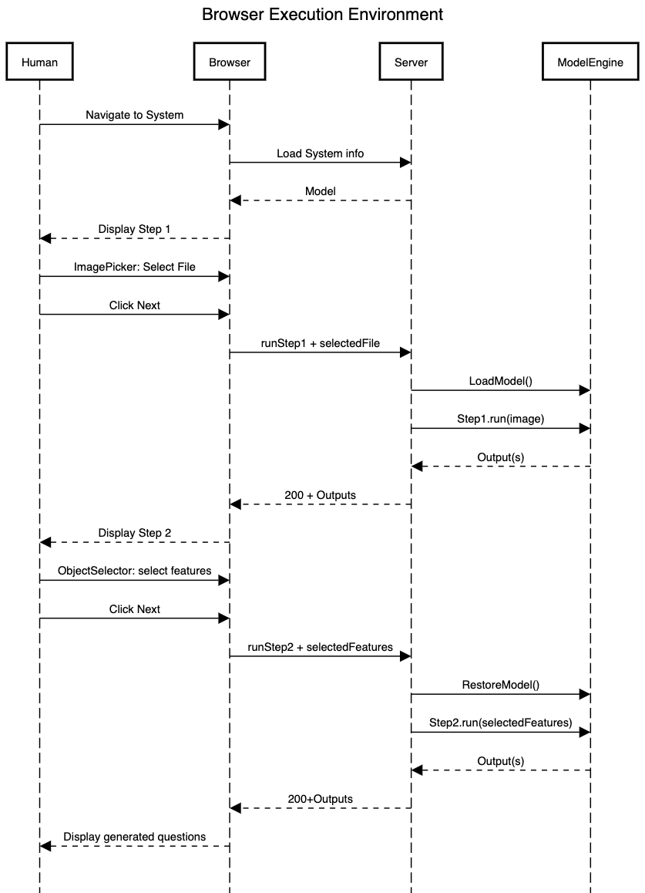
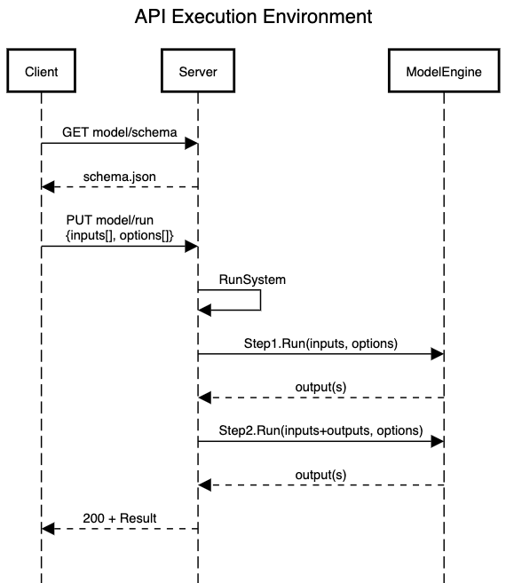
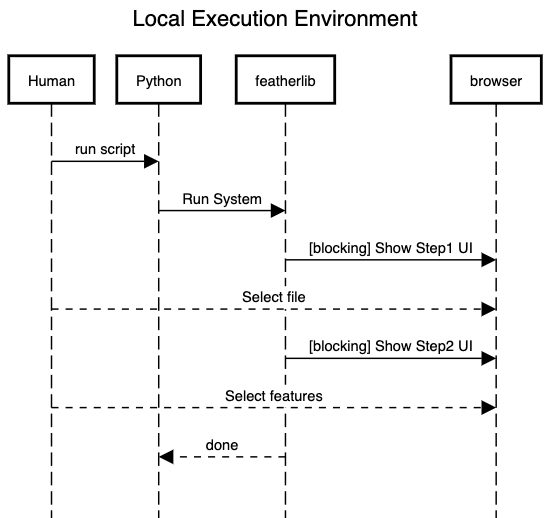

# Overview

A System needs to support a number of different execution environments:

1. Browser environment
2. Service API environment
3. Local environment

All 3 need to be supported from the same Python file.

## Browser Environment

Flow for a user interacting with a 2 step model. In a browser environment, the model's steps are necesserally executed completely independently. The execution time between steps is unbound. For example, the user may run step1, put the laptop to sleep and resume in the morning.
If steps are connected solely via inputs and outputs, then it maps naturally - inputs are sent with the HTTP requests, and the outputs are returned to the browser in the response. 

UI Components should not be allowed inside steps, at least to start with. Each component necessitates a trip to the server. So a component inside a step would involved suspending the step execution to await user input and the resuming execution. This is theoretically possible but is a technical challenge.

[Source Code](https://sequencediagram.org/index.html#initialData=C4S2BsFMAIBUAsQGdrOgQ2qCkBQuAJAVwFt0A7AWgD4AhAJwHsB3JSegLgDl0A3EAObpgMYI2gBlAJ5IRJXAxZt6NCe17sOAGUboAJpJlzU5AGaMFTVuwA8lSmvobOAWUZ7I4QqQp3Ki604AEWQAB3B0KUkRUOgARm8yKjorZQ4ASTIBSAAFEABjAGtNSU9IfOBoADEQKESKGgC0gGFwAsLoLkgAD2BLJXZVdU16InIJGLjoAGpoNigKyD0ausdnGjcPcABRcgEQckhtXT1NzwAKAEpcNcHqM529g6OJyFC4gDpR8nOQLMhrrd6H4Hrt9ocOAB5IjAUIw85Ia5NWz2IEcABMAAZMTNoNDYTCkPVyH5kcEwhEoq9YujiY1UppIQAjABW5WAagWYk4czKFWgpkgwiI9EgROISXpA04rXanR6fTJQycIzG1PRuPm7KWVSFwBFYpuwxU93cnjBzw4ACUxdzIA8rrgAPRO6JvFCHJZYcRMmAHDyhSDkDzkYAAGgwwegjHI4CioC9TKiBzhwBQFAMjBhqaQHzxwHg7GYyEgEeYME9BjEcz4MFkwhgGegotkjFFc2ADeghdFHyNKpNoKeEPVXzGCL5ImWeoNiP7zhBZse4KO+NTCKRDOBqONGOx0zXhOJpK3HBCSHCkWg2UO9AbBgAjkRbSAY0ggA)

## Service API Environment

In the API Execution Environment, the system is run through a remote service API call, eg HTTP POST. The run request needs to provide the entire info needed to run the system, including all inputs and all configuration data for components. 
As an example, if Step2 contains a component to select features from an image, the the component needs to support an input 'filter' or rule. This rule would be provided by the HTTP request, such that when the system is running it does what the client wants. They may want to pick all "\*cat\*" objects for example.

[Source Code](https://sequencediagram.org/index.html#initialData=C4S2BsFMAIEEAUCS0CiAPSBjArqA9gHaoEBuIAToQLaQHABQ9AwuCLcALQB8AypOSX4AuAOIoAKtCp4AJpHAB6AM6YAFpCoBDZq3YAeDhz4DhK9VoB0AKyWFGLNnW7HB5IfACqk6XMXlsBAA6BADeIAQADrhKANoAugA00HgR+ASxcQC+9C78zvyuQgBKATwAnkrAGjkFeVwAsrLyKAQA5uGQQtA8VREAjBYlBAAU4VHASkkpaUoAlDUm5AYcjb4t7QSdybjjw3MLrtyrzW0dXT2QEQBMgwGjkdEA1Hg70VOpIIT7uUuGx+DrM7bYC7fYOfSGH5dK4ABhh0Ee0CKkCU2HAwCAA)

## Local Environment

In a local environment, we will display a web browser to the user, to interact with the system and the steps. Similar to the Browser environment above, but the difference being all interaction is in process as far as the python script is concerned. We need to be particularly careful here, since it's easy for steps to reference data from outside the step (ie. another step). It will work as they are all resident in memory, in the same process. But this then won't work when uploaded to feather. Our Python SDK will need to provide functionality to help avoid this.

[Source Code](https://sequencediagram.org/index.html#initialData=C4S2BsFMAIBkHsDGBDc0CiAPSiCup4A7DQgNxACciBbSQ4AKAYAldrlCBaAPgAUBPYAAsiALgq5iAZ0QUQAB0YDhRHgDNIyYZArgQAI1HQASpOgBlflOCRqDDVqE69+nvqoB3KTtEBtfeBIANYghADmALoWIh4WNvIAjNAAqgCSLGwcnG6e3hRG5pBQiMDQaiBQ9praugY58F4+0P6BiCHhUeYxcZDyAEwp6azsXPWN+RZFOKUOwLgUkFIMyiKEADzZs061htAAJkSQDEA)

There is another flaviour of the local environment execution. The user may not want to manually interact each time. As such we should support providing all inputs and options in the script and maybe even via environment variables. This should not be hard, since it involves the components pulling their data not from a UI component, but from a 'config' file. Exactly the same as is needed when running server side in API execution.